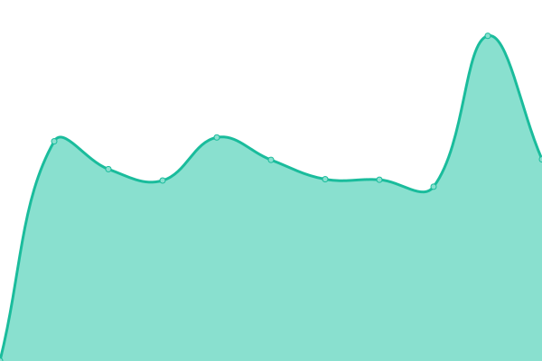

# [📈 Live Status](https://BeeCorp.github.io/upptime-verifli): <!--live status--> **🟩 All systems operational**

This repository contains the open-source uptime monitor and status page for [BeeCorp](https://BeeCorp.github.io/upptime-verifli), powered by [Upptime](https://github.com/upptime/upptime).

With [Upptime](https://upptime.js.org), you can get your own unlimited and free uptime monitor and status page, powered entirely by a GitHub repository. We use [Issues](https://github.com/BeeCorp/upptime-verifli/issues) as incident reports, [Actions](https://github.com/BeeCorp/upptime-verifli/actions) as uptime monitors, and [Pages](https://BeeCorp.github.io/upptime-verifli) for the status page.

<!--start: status pages-->
<!-- This summary is generated by Upptime (https://github.com/upptime/upptime) -->
<!-- Do not edit this manually, your changes will be overwritten -->

| URL                                        | Status | History                                                                                                | Response Time                                                                     | Uptime                                                                                                                                                                                                                                   |
| ------------------------------------------ | ------ | ------------------------------------------------------------------------------------------------------ | --------------------------------------------------------------------------------- | ---------------------------------------------------------------------------------------------------------------------------------------------------------------------------------------------------------------------------------------- |
| [Verifli](https://verifli.com)             | 🟩 Up  | [verifli.yml](https://github.com/BeeCorp/upptime-verifli/commits/master/history/verifli.yml)           |  702ms      |            |
| [Verifli (Beta)](https://beta.verifli.com) | 🟩 Up  | [verifli-beta.yml](https://github.com/BeeCorp/upptime-verifli/commits/master/history/verifli-beta.yml) |  557ms |  |
| [Verifli (Demo)](https://demo.verifli.com) | 🟩 Up  | [verifli-demo.yml](https://github.com/BeeCorp/upptime-verifli/commits/master/history/verifli-demo.yml) |  242ms |  |

<!--end: status pages-->

[**Visit our status website →**](https://BeeCorp.github.io/upptime-verifli)

## 📄 License

- Code: [MIT](./LICENSE) © [BeeCorp](https://BeeCorp.github.io/upptime-verifli)
- Data in the `./history` directory: [Open Database License](https://opendatacommons.org/licenses/odbl/1-0/)
